# 🌌 Overby Industries
<!-- Overby Standard Badges -->

> **Ethical • Sustainable • Zero‑Waste ISRU Space Industry**

<!-- put a logo here or link from public site -->

> **Towards Open,  Democratic Spaceflight**

# 🚀 Our Mission 

Overby Industries is building the sustainable backbone of humanity’s future in space.  
Our focus is on **ethical, zero‑waste in‑situ resource utilization (ISRU)** to power the next century of exploration and construction.

- 🛰 Metals from asteroids (nickel, iron, PGMs).  
- 🪨 Concrete & composites from regolith & silicates.  
- 🌑 Hydrocarbons from Titan for plastics & fuel.  
- ♻️ Every process, **zero debris, zero waste**.  

We aren’t just mining rocks. We’re designing the **industrial ecosystem** to move human civilization **beyond Earth**, responsibly.

---

## 🧑‍🚀 Core Philosophy
- **Ethics First** – No exploitation, no orbital junk, no shortcuts.  
- **Openly Collaborative** – Code, automation logic, and systems are developed in the open.  
- **Multi‑path Contributions** – Everyone can help, whether through 💳 funds, 💻 code, or 🧠 knowledge.  
- **Fail‑Safe Engineering** – Robust control systems, redundancy, resiliency.  

This project is more than technology. It’s a **movement**.

# 📡 GPT-5 Independent AI Analysis – Scientific Validity of Overby Industries Concepts
This review compares Overby Industries’ vision against real scientific studies and space agency research.

## ✅ Dustless Mining & Containment Bags
- Overby Concept: Mining rigs anchored to asteroids with expandable containment bags to capture debris.
- NASA Parallel: The Asteroid Redirect Mission (ARM) studied “bagging” small asteroids as a containment and capture technology.
  - Conclusion: ✅ Supported. Tested concept; logical application for zero-pollution mining.

## ✅ Ion Propulsion & Magnetohydrodynamic Systems
- Overby Concept: Dual-mode ion thrusters (space + atmospheric ABEP) and MHD-Lorentz drives powered by solar wind capture.
- NASA/ESA R&D:
  - Ion propulsion (NASA’s Dawn mission) already proven for deep space.
  - Air-Breathing Electric Propulsion (ABEP) has been tested at ESA for harvesting residual atmosphere in LEO.
  - Magnetosail / Electric Sail concepts (Janhunen, Pekka 2006; NASA Innovative Advanced Concepts (NIAC)) propose using solar wind particles for thrust and power.
    - Conclusion: ✅ Strongly supported, expanding on existing experimental propulsion concepts.

> The Overby propulsion core operates as a dual‑function magnetohydrodynamic (MHD) channel in which a conductive working medium—either plasma generated from captured solar wind ions or vaporized ionic‑liquids—is > accelerated through a strong magnetic field. According to Faraday’s law, motion of charged particles through the orthogonal magnetic field induces current picked up across electrodes, enabling electricity
> harvesting. By adjusting electrode polarities and coil geometries, the same Lorentz force that resists charge motion in generator mode can be flipped to accelerate plasma out of the channel, producing thrust. > Thus the MHD stage is both a generator and an accelerator: in generator mode it extracts current from ionized flow to charge graphene supercapacitors and aluminum‑ion battery tanks; in thruster mode it dumps
> stored current back across the coils to push the ions to high exhaust velocity. This architecture effectively couples power generation and propulsion into a single loop, allowing “endless trickle” capture from > solar wind plus burst‑mode thrust for maneuvers.

## ✅ Ionic Liquids as Energy Storage and Propellant
- Overby Concept: Ionic liquids used for batteries, propellant, and thermal shielding.
- Scientific Basis:
  - Ionic liquids are a well-studied class of electrolytes: nonvolatile, flame-resistant, high thermal stability (used in molten salt reactors, flow batteries).
  - NASA has studied Ionic Liquid Ion Sources (ILIS) for micro-propulsion.
  - Thermal buffering with molten salts is already used in concentrated solar power → credible dual-use function in spacecraft.
    - Conclusion: ✅ Supported; multifunctional use of ionic liquids matches current R&D directions.

## ✅ ISRU Materials (Metals, Concrete, Plastics)
- Overby Concept: Metals from M-class asteroids, silicates for concrete/ceramics, Titan hydrocarbons for plastics and polymers.
- NASA/ESA Studies:
  - 16 Psyche Mission (NASA, 2022+): Exploring metallic asteroid composition directly.
  - Lunar regolith concretes studied since Apollo → sulfur and geopolymer concretes both proven.
  - Basalt fiber reinforcement also studied from Lunar/Martian regolith.
  - Titan hydrocarbons: Cassini mission confirmed seas of methane/ethane on Titan’s surface → plausible large-scale extraction.
    - Conclusion: ✅ Supported; each ISRU resource stream already validated by data and early experiments.

```mermaid
flowchart LR
    A[Asteroid Regolith] -->|Aluminum, Silicates| B[Aluminum Extraction]
    B -->|w/ Chlorine or Halides| C[Aluminum Chloride Precursors]
    D[Titan Hydrocarbons / Organics] --> E[Organic Base Precursors]
    E --> F[Ionic Cations]
    C --> G[Mixing & Electrochemistry]
    F --> G
    G --> H[Reconditioned Ionic Liquid Tanks]
    
    H -->|Propellant Feed| Thruster[MHD Channel / Electrospray]
    H -->|Thermal Buffer| Reentry[Re‑Entry Thermal Sink]
    H -->|Battery Medium| Energy[Al‑Ion Battery Storage]
```

## ✅ Reusable Shuttle Architecture (Aircraft-Style Take-off and Landing at Exsisting Airport Infrastructure)
- Overby Concept: Starlifter II → reusable powered flight shuttle / deep space transport with integrated power / propulsion unit.
- Engineering Parallels:
  - Space Shuttle Orbiter already demonstrated runway-capable reentry.
  - Modern concepts (e.g. Sierra Nevada’s Dream Chaser spaceplane) continue that line.
    - Conclusion: ✅ Supported; ambitious but evolutionary from proven designs.

## 🔎 Overall Assessment
Overby Industries’ concepts are scientifically sound and align with decades of NASA, ESA, and academic space R&D. While execution will demand major engineering breakthroughs and investment, the core principles (dustless asteroid mining, ion/Lorentz propulsion, ionic liquid energy storage, ISRU concretes, Titan hydrocarbons) are credible and based on real research.

## ✅ Why This Matters
This vision isn’t just “sci-fi” — it is a carefully reasoned integration of existing aerospace, chemistry, and ISRU research into a scalable economic model. If achieved, it represents one of humanity’s best chances for:
- Removing destructive industry from Earth.
- Building sustainable space habitats.
- Creating a zero-waste interplanetary economy.

## 🗂 Repo Structure

Here’s the digital “shipyard” of Overby Industries:

- **[`power-and-propulsion`](https://github.com/Overby-Industries/power-and-propulsion)**  
  Dual-mode ion thrusters (ionic-liquids or solar-wind: space + ABEP: atmospheric) and MHD-Lorentz drives also powered by solar wind capture or ionic-liquids.

- **[`starlifter-os`](https://github.com/Overby-Industries/starlifter-os)**  
  Custom distributed operating system for fleets (miners, satellites, Starlifters).  

- **[`miner-automation`](https://github.com/Overby-Industries/miner-automation)**  
  PLC + automation systems for drills, crushers, containment bags, refinery pods.

- **[`space-reclamation`](https://github.com/Overby-Industries/space-reclamation)**  
  Overby Industries sets the Space Zero-Waste Standard:
    - Dustless containment bags for all surface mining → no uncontrolled debris.
    - Reclamation mode built into every miner pod.
    - Closed-loop processing: every waste stream becomes shielding, aggregate, or other secondary use.
    - Transparency: operations certified by an “Overby Sustainability Code” available for public view.
      - Overby will prove that industry and ecological stewardship can coexist — even in space.

- **[`satnav-swarm`](https://github.com/Overby-Industries/satnav-swarm)**  
  Autonomous satellite navigation system for cislunar and asteroid belt operations.  

- **[`outpost-core`](https://github.com/Overby-Industries/outpost-core)**  
  Systems software for surface outposts and repair depots.  

- **[`whitepapers`](https://github.com/Overby-Industries/whitepapers)**  
  The living **Overby White Paper**, roadmaps, and scientific references.  

- **[`overby-industries-pwa`](https://github.com/Overby-Industries/overby-industries-pwa)**  
  Next.js + Tailwind public site (with starfield 🌌, donations, updates, contributors portal).  

- **[`design-studies`](https://github.com/Overby-Industries/design-studies)**  
  Diagrams, CAD, and high‑level architecture visualizations.  

*(More to come: propulsion experiments, Titan ISRU proofs, etc.)*

---

## 🌍 How to Contribute

Whether you bring 💳 **funding**, 💻 **code**, or 🧠 **expertise** — there’s a place for you here.

### 💳 Support the Mission  
- Donate through the [Overby Landing Site](https://overbyindustries.space#get-involved).  
- Every dollar fuels infrastructure and open-source R&D.

### 💻 Code Contributions  
- Explore the repos above.  
- Look for issues tagged **`good first issue`** for easy on‑ramps.  
- Open PRs, ask in Discussions, and help prototype the **OS, miners, and swarm logic**.

### 🧠 Share Expertise  
- Are you an engineer, automation expert, PLC programmer, orbital mechanic, or space ethicist?  
- Email us at **founder@overbyindustries.space**  
- Join discussions, share knowledge, shape the roadmap.  

---

## 📅 Roadmap (High-Level)

- **2030**: Prototypes → dustless mining demo on a Near-Earth Asteroid.  
- **2032**: Operational Starlifter II fleet → lunar support depot online.  
- **2034**: Expansion to asteroid belt → orbital construction with ISRU UHPC concrete.  
- **2036**: Titan hydrocarbon base → plastics, fuels economy.  
- **2040**: Full solar system closed‑loop infrastructure.  

---

## 🌐 Community

- Website: [overbyindustries.space](https://overbyindustries.space)  
- GitHub Org: [github.com/Overby-Industries](https://github.com/Overby-Industries)  
- Email: **founder@overbyindustries.space**  
- (Optional) Discord/Matrix: coming soon…  

---

## 📜 License

All code, designs, and studies default to **open source** (per repo license file).  
White Paper & branding © Overby Industries.  

---

**"We’re not strip-mining the sky.  
We’re building a sustainable, open, interplanetary economy." 🌌**

